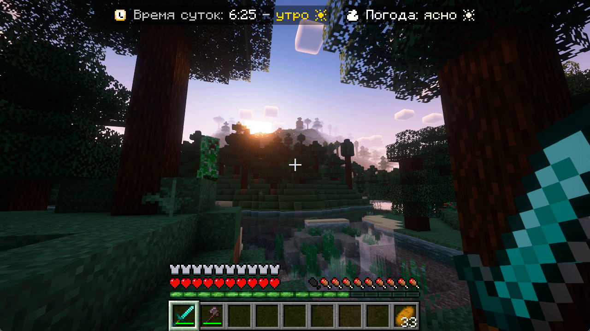

<h3 align="center">
  
  <br>
  <br>
  <p>Simple addon for PlaceholderAPI for configurable day time and weather display</p>
  <br>
  <br>
  <u>English</u> | <b><a href="README_RU.md">Russian</a></b>
</h3>

# 💾 Requirements

- Java **8+**
- Paper **1.16.5+**

# 🚀 Getting started

1. Install [PlaceholderAPI](https://spigotmc.org/resources/6245) plugin and restart server
2. Install [WorldStatusPlaceholder](https://github.com/MrDrag0nXYT/WorldStatusPlaceholder) to
   `/plugins/PlaceholderAPI/expansions/`
3. Run `/papi register WorldStatusPlaceholder-[VERSION].jar` or restart server.
   (Replace `[VERSION]` to WorldStatusPlaceholder version)
4. Configure it in PlaceholderAPI config, for example it can be:

```yaml
expansions:
  worldstatus:
    morning: '<#ffd700>morning ☀'
    day: '<#00bfff>day ☀'
    evening: '<#ff4500>evening ☄'
    night: '<#99b6d5>night ☽'

    cleanWeather: '<#f2f2d9>clean ☀'
    raining: '<#00bfff>raining ☔'
    thundering: '<#7f8eae>thundering ⛈'

    world: world
```

# 🔹 Configuration

`world` - name of world that stats will show. If empty - used player world

# 📌 Placeholders

- `%worldstatus_weather%` - shows weather (clear, raining, thundering)
- `%worldstatus_daytime%` - shows daytime (morning, day, evening, night)

# 📸 Screenshots

Sample of usage with `%world_time_world%` placeholder
and [CustomNameplates](https://github.com/Xiao-MoMi/Custom-Nameplates) plugin:




Shaders: [Complementary Shaders - Reimagined](https://modrinth.com/shader/complementary-reimagined)

# ⚙ Other information

### If you find a bug or want to help with development, feel free to contact me

- Contact links [here](https://drakoshaslv.ru/)

### You can also (optionally) donate me:

- [DonationAlerts](https://www.donationalerts.com/r/mrdrag0nxyt)
- TON: `UQAwUJ_DWQ26_b94mFAy0bE1hrxVRHrq51umphFPreFraVL2`
- ETH: `0xf5D0Ab258B0f8EeA7EA07cF1050B35cc12E06Ab0`
- TRX: `TFUeDgKk7mrjR4MQx3H1B9ju9Wpa1FNAwU`
- SOL: `4t9q2curHY4EL2skydjzUZ5JvbrLEmkZN5gHBu6qTPyN`

<h3 align="center">Also check my server - <a href="https://nshard.ru">NightShard</a></h3>
