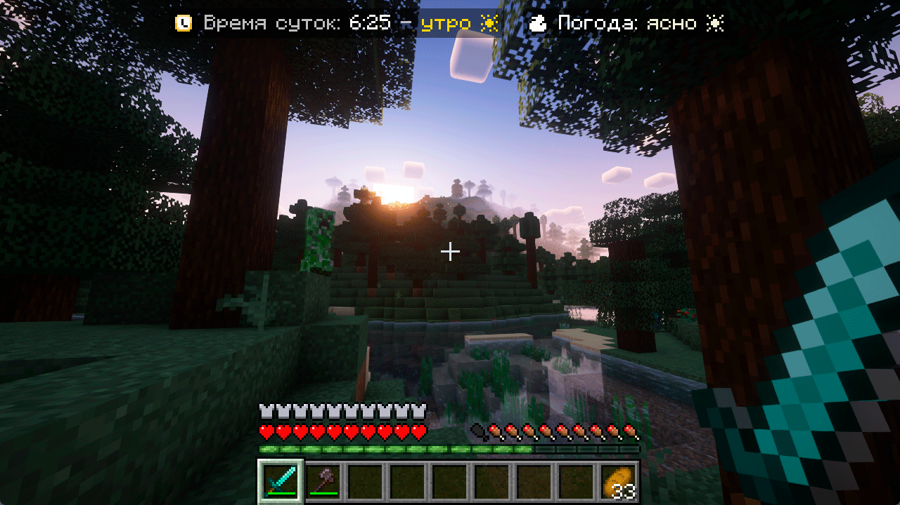
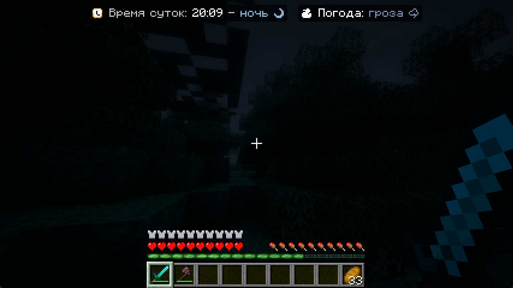

<h3 align="center">
  
  <br>
  <br>
  <p>Простой аддон для PlaceholderAPI для красивого отображения времени суток и погоды</p>
  <br>
  <br>
  <b><a href="README.md">English</a></b> | <u>Russian</u>
</h3>

# 💾 Системные требования

- Java **8+**
- Paper **1.16.5+**

# 🚀 Начало работы

1. Установите плагин [PlaceholderAPI](https://spigotmc.org/resources/6245) и перезапустите сервер
2. Установите [WorldStatusPlaceholder](https://github.com/MrDrag0nXYT/WorldStatusPlaceholder/releases/latest) в папку
   `/plugins/PlaceholderAPI/expansions/`
3. Используйте для запуска команду `/papi register WorldStatusPlaceholder-[VERSION].jar` или перезапустите сервер.
   (Замените `[VERSION]` на версию WorldStatusPlaceholder)
4. Настройте отображение в конфиге PlaceholderAPI, например так:

```yaml
expansions:
  worldstatus:
    morning: '<#ffd700>утро ☀'
    day: '<#00bfff>день ☀'
    evening: '<#ff4500>вечер ☄'
    night: '<#99b6d5>ночь ☽'

    cleanWeather: '<#f2f2d9>ясно ☀'
    raining: '<#00bfff>дождь ☔'
    thundering: '<#7f8eae>гроза ⛈'

    world: world
```

# 🔹 Конфигурация

`world` - имя мира для которого будет показываться информация. Если пусто - будет браться мир игрока

# 📌 Плейсхолдеры

- `%worldstatus_weather%` - показывает погоду (ясно, дождь, гроза)
- `%worldstatus_daytime%` - показывает время суток (утро, день, вечер, ночь)

# 📸 Скриншоты

Пример использования с плейсхолдером `%world_time_world%` и
плагином [CustomNameplates](https://github.com/Xiao-MoMi/Custom-Nameplates):




Шейдеры: [Complementary Shaders - Reimagined](https://modrinth.com/shader/complementary-reimagined)

# ⚙ Дополнительно

### Если вы нашли баг или хотите помочь в разработке - не стесняйтесь обращаться ко мне

- Ссылки на контакты [тут](https://drakoshaslv.ru/)

### Также (по желанию) вы можете дать мне денег:

- [DonationAlerts](https://www.donationalerts.com/r/mrdrag0nxyt)
- TON: `UQAwUJ_DWQ26_b94mFAy0bE1hrxVRHrq51umphFPreFraVL2`
- ETH: `0xf5D0Ab258B0f8EeA7EA07cF1050B35cc12E06Ab0`
- TRX: `TFUeDgKk7mrjR4MQx3H1B9ju9Wpa1FNAwU`
- SOL: `4t9q2curHY4EL2skydjzUZ5JvbrLEmkZN5gHBu6qTPyN`

<h3 align="center">А также можете посмотреть на мой проект - <a href="https://nshard.ru">NightShard</a></h3>